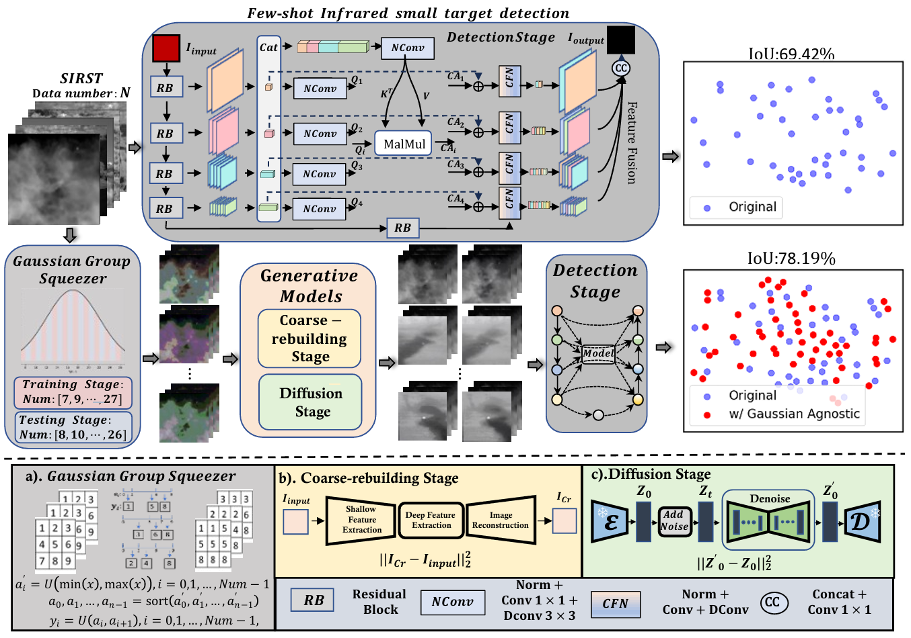
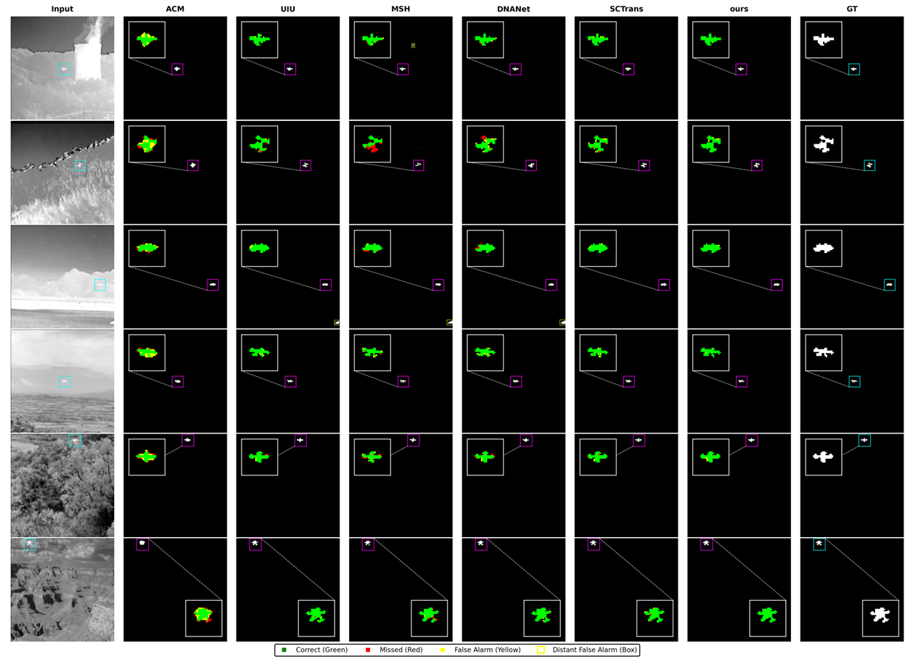

# Exploiting Gaussian Agnostic Representation Learning with Diffusion Prior for Enhanced Infrared Small Target Detection

### Overview


**Abstract:** 
 Infrared small target detection (ISTD) plays a vital role in numerous practical applications. In pursuit of
 determining the performance boundaries, researchers employ large and expensive manual-labeling data
 for representation learning. Nevertheless, this approach renders the state-of-the-art ISTD methods highly
 fragile in real-world challenges. In this paper, we first study the variation in detection performance
 across several mainstream methods under various scarcity– namely, the absence of high-quality
 infrared data– that challenge the prevailing theories about practical ISTD. To address this concern,
 we introduce the Gaussian Agnostic Representation Learning. Specifically, we propose the Gaussian
 Group Squeezer, leveraging Gaussian sampling and compression for non-uniform quantization. By
 exploiting a diverse array of training samples, we enhance the resilience of ISTD models against
 various challenges. Then, we introduce two-stage diffusion models for real-world reconstruction. By
 aligning quantized signals closely with real-world distributions, we significantly elevate the quality and
 fidelity of the synthetic samples. Comparative evaluations against state-of-the-art detection methods in
 various scarcity scenarios demonstrate the efficacy of the proposed approach.

### Visual


## Preparation

### Install

First,create an environment with python = 3.9.

1. Create a new conda environment
```
conda create -n EGARL python=3.9

conda activate EGARL
```

2. Install dependencies
```
pip install -r requirements.txt
```
### Data
Data Preparation
1. Generate file list of training set and validation set.

    ```shell
    python scripts/make_file_list.py \
    --img_folder [hq_dir_path] \
    --val_size [validation_set_size] \
    --save_folder [save_dir_path] \
    --follow_links
    ```
    
    This script will collect all image files in `img_folder` and split them into training set and validation set automatically. You will get two file lists in `save_folder`, each line in a file list contains an absolute path of an image file:
    
    ```
    save_folder
    ├── train.list # training file list
    └── val.list   # validation file list
    ```
2. Configure training set and validation set.

    - [training set](configs/dataset/general_deg_codeformer_train.yaml) and [validation set](configs/dataset/general_deg_codeformer_val.yaml) for degradation.

### Train
1.Download pretrained [Stable Diffusion v2.1](https://huggingface.co/stabilityai/stable-diffusion-2-1-base) to provide generative capabilities.

```shell
wget https://huggingface.co/stabilityai/stable-diffusion-2-1-base/resolve/main/v2-1_512-ema-pruned.ckpt --no-check-certificate
```
2.train
```sh
python train.py --config configs/train_swinir.yaml
```
3.Create the initial model weights.

```shell
python scripts/make_stage2_init_weight.py \
--cldm_config configs/model/cldm.yaml \
--sd_weight [sd_v2.1_ckpt_path] \
--swinir_weight [swinir_ckpt_path] \
--output [init_weight_output_path]
 ```
4.train
```shell
python train.py --config configs/train_cldm.yaml
```


### Generate

```shell
python inference.py \
--input lq_dir_path \
--config configs/model/cldm.yaml \
--ckpt weights/your_generatecldm.ckpt \
--reload_swinir --swinir_ckpt weights/your_generateswinir.ckpt \
--steps 50 \
--sr_scale 1 \
--color_fix_type wavelet \
--output results/demo/general \
--device cuda [--tiled --tile_size 512 --tile_stride 256]
```


## Acknowledgement
This project is build based on [DiffBIR](https://github.com/XPixelGroup/DiffBIR) and [SCTransNet](https://github.com/xdFai/SCTransNet). We thank the authors for sharing their code.
